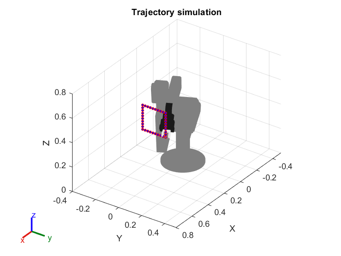
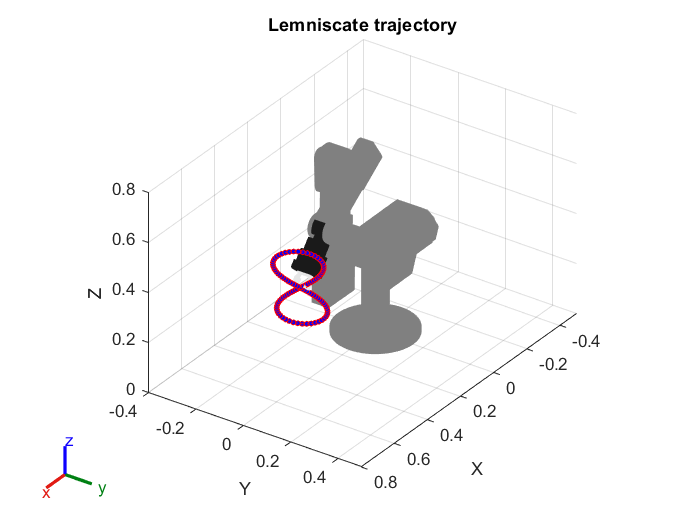

<h1 align="center">
    Accuracy and Precision Tests 
    of the Neuromorphic Robotic Arm ED-Scorbot
</h1>

    This repository contains scripts and tools developed to evaluate the performance of the ED-Scorbot neuromorphic robotic arm through accuracy and precision tests. The aim is to analyse the system’s ability to reach specific positions and consistently repeat movements when executing reference trajectories.

<h2 align="left">Accuracy and precision test</h2>

    Accuracy and precision shall be evaluated according to the definitions established in ISO 9283, which take into account the repetition of the movement towards a target for the calculation of the mean deviation of the Tool Center Point (TCP).
    The tests were performed by controlling parameters such as time intervals between sending commands (CTI) and distances between points (PTPD) on a reference trajectory.

<h2 align="left">Reference trajectories</h2>

  
  

  <a href="images/square.fig">Download Square FIG</a>
  <a href="images/lemniscate.fig">Download Lemniscate FIG</a>

