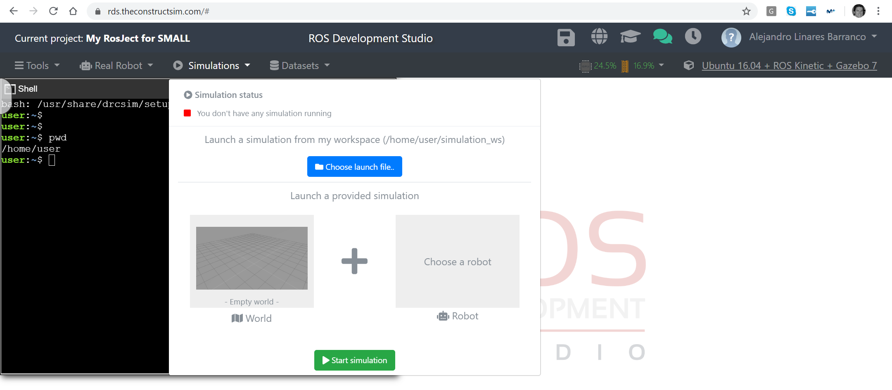
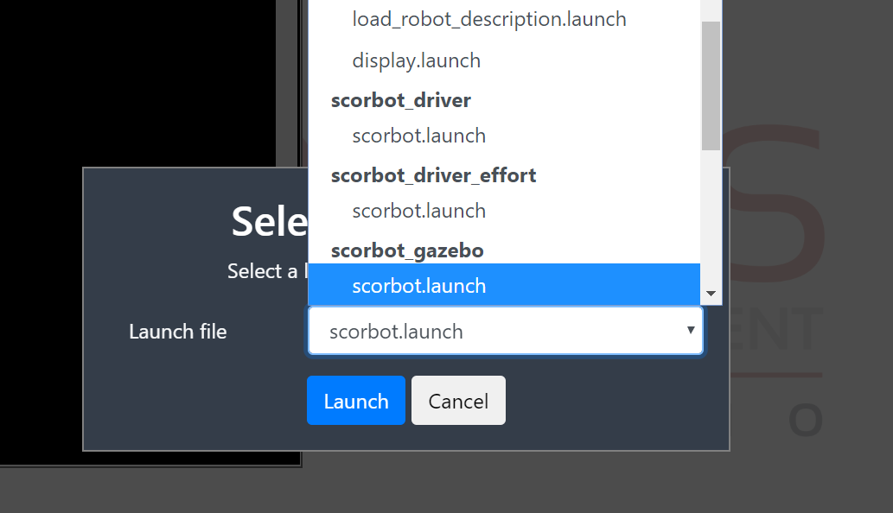
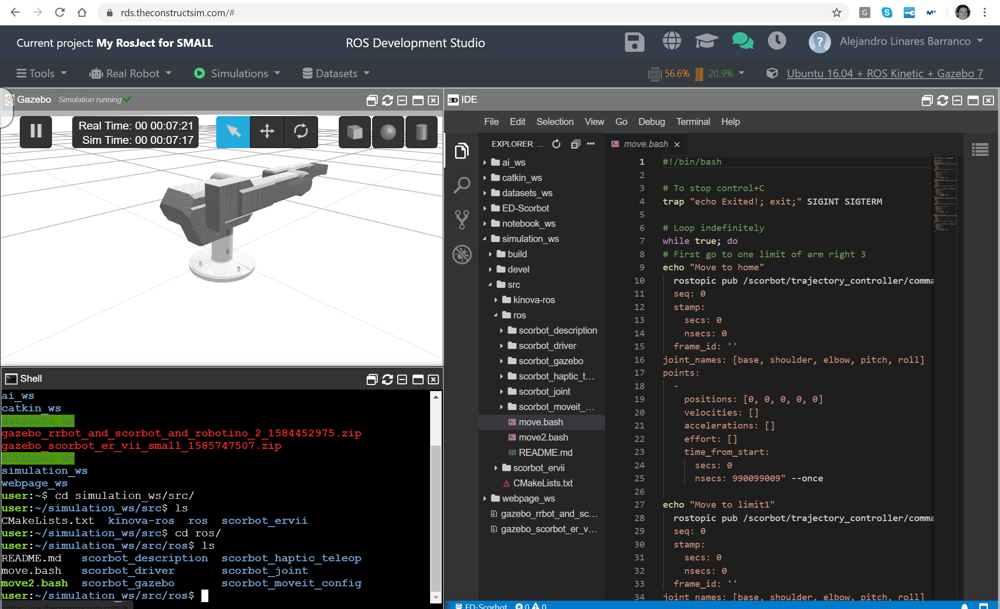
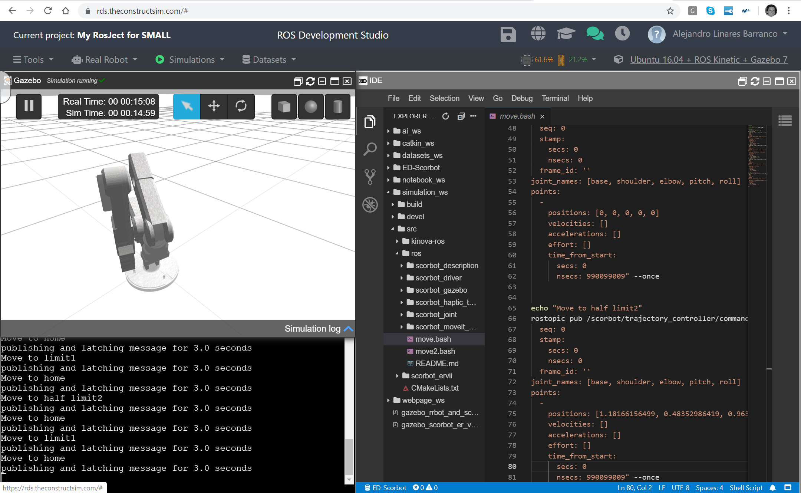
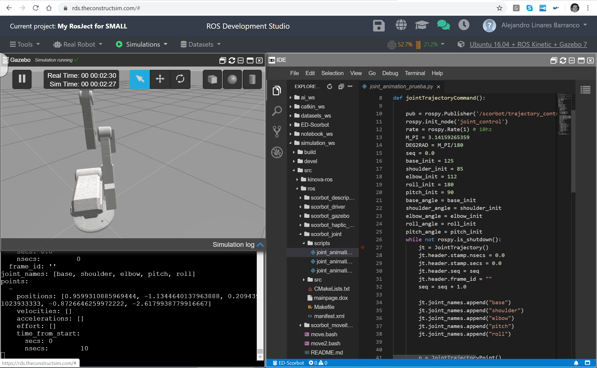

# ED-Scorbot
Event-based Scorbot ER-VII
CHIST-ERA SMALL project (2020-2023)

SMALL investigates options for learning in low-power unconventional hardware that is based on spiking neural networks (SNNs) 
implemented in analog neuromorphic hardware combined with nano-scale memristive synaptic devices. Hence, the envisioned computational 
paradigm combines the three most promising avenues for minimizing energy consumption in hardware: (1) analog neuromorphic computation, 
(2) spike-based communication, and (3) memristive analog memory. “In the field” applications often demand online adaptation of such 
systems, which often necessitates hardware-averse training procedure. To overcome this problem, we will investigate the applicability 
of “learning to learn” (L2L) to spiking memristive neuromorphic hardware. In an initial optimization, the hardware is trained to become 
a good learner for the target application. Here, arbitrarily complex learning algorithms can be used on a host system with the hardware 
“in the loop”. In the application itself, simpler algorithms – that can be easily implemented in neuromorphic hardware – provide 
adaptation of the hardware RSNNs. In summary, the goal of this project is to build versatile and adaptive low-power small size 
neuromorphic AI machinery based on SNNs with memristive synapses using L2L. We will deliver an experimental system in a real-world 
robotics environment to provide a proof of concept.

This repo is devoted to that robotics environment. The ED-Scorbot is an event-driven controlled robotic arm. The robot has been adapted 
for being controlled through spike-based controllers. More info can be obtained at http://www.rtc.us.es/ed-scorbot 

For this project, a simulation scenario is being developed for ROS. In this repo you can find two different implementations: one compatible 
to RDS (Robotic Development Studio, available throgh this link: http://www.rosject.io/l/11c04055/ ), and another that can be executed in 
your own Linux computer.

These two main simulation scenarios are divided in two different folders: scorbot_gazebo_effort and RDS_files

# RDS_files
This is a backup copy of the /home/user/ folder of the on-line virtual machine from RDS (https://www.theconstructsim.com/rds-ros-development-studio/)

In this VM we copied and adapted the scorbot ERVII gazebo project from https://github.com/rorromr/scorbot 
This project was oriented to trajectory control of the joints. We added the position and effort controllers.

## Trajectory control
To execute this controller on the RDS virutal machine, you have to open (or fork if you wish to make your own changes) the machine 
http://www.rosject.io/l/11c04055/ . You can also create a new one from scratch and add the files of RDS_files folder to your /home/user 
folder. It has been tested with Linux 16.04 and Gazebo 7. Once the VM is running, go to the Simulations Menu and click on "choose launch 
file" button. Select the "scorbot_gazebo" section and the scorbot.launch file of this section, like next figures:

From menu "Tools" open a Shell windows and the IDE to explore files.

### Executing a trajectory with console commands

In the IDE open the file "simulation_ws/src/ros/move.bash"
This command file is running the rostopic command to publish a trajectory message with only one point in the topic
/scorbot/trajectory_controller/command
The message expected has the common format trajectory_msgs/Joint_trajectory
Each time the command is called to publish a message, the joint angles of the robot are modified. Their joint angles are specified in 
radians.

To execute the trajectory with this sequence of published messages one by one we have to run the shell:

bash ./move.bash

Be sure that the file move.bash has execution rights (chmod +x move.bash)

### Executing a trajectory with a phyton file
With the Phyton script you can add a sequence of points to the trajectory before publishing it to the trajectory command topic.
Open in the IDE the file simulation_ws/src/ros/scorbot_joint/scripts/joint_animation_prueba.py and check how the process is done 
for phyton. Check if this .py file has execution rights, if not add it by the command 'chmod +x joint_animation_prueba.py' 
To execute the phyton script you have to run this command in the shell:

rosrun scorbot_joint joint_animation_prueba.py

You will see the robot moving from point to point in the gazebo window and the state of the joints in numerical values in the shell 
window:

# Scrobot Gazebo Effort
